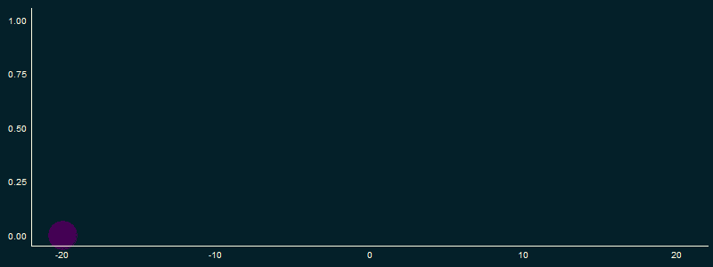

> R Programming: <br>
> Creating a GIF in R <br>
> Using ggplot 

Creating a GIF in <code>ggplot</code> is extremingly simple and only requires one additional package beyond <code>ggplot2</code>.

Below, I will demonstrate a simple example.  However, it will be clear how to expand by this use case to create dynamic plots.  

###### *Why would you want to create a GIF with ggplot?*

The most common answer would be for use with time series data.  Another possibility would be a change in an assumption, for examples see <a href="conclusion>conclusion</a>.

Hans Rosling is one of the best known practicioners of this form of data visualization.  In his most famous lecture, he plots 200 countries over 200 years using 120,000 numbers.  This entails plotting life expectancy against income for every country since 1810.  By having the plots scroll through each consective year, he shows the progress in which the world has made in becoming "less sick" and "more wealthy".

An example of his lecture can be found here: <br>
https://www.youtube.com/watch?v=jbkSRLYSojo

# Setup

The two packages we need our <code>ggplot2</code> and <code>gifski</code>.  

<code>gifski</code> will be used to convert a series of plots into a gif.

```{r}
library(pacman)
pacman::p_load(knitr, ggplot2, gifski, viridis)
  
knitr::opts_chunk$set(echo=TRUE, message=FALSE, comment=NA, warning=FALSE, tidy=TRUE, results="hold", cache=FALSE, dpi=120)

## Chart Template
Grph_theme <- function() {
  theme(panel.background=element_rect(fill="#042029", color="#042029")) +
  theme(plot.background=element_rect(fill="#042029", "#042029")) +  
  theme(panel.grid.major=element_blank()) +
  theme(panel.grid.minor=element_blank()) +
  theme(axis.ticks=element_blank()) +
  theme(legend.position="none") +
  theme(legend.title=element_text(size=16,color='#fffff0')) +
  theme(legend.text=element_text(size=14,color='#fffff0')) +
  theme(strip.text.x=element_text(size=14,color='#fffff0',vjust=1)) +
  theme(plot.title=element_text(size=20, vjust=1.25)) +
  theme(axis.text.x=element_text(size=10,color='#fffff0')) +
  theme(axis.text.y=element_text(size=10,color='#fffff0')) +
  theme(axis.line.x=element_line(color='#fffff0')) +
  theme(axis.line.y=element_line(color='#fffff0')) +    
  theme(axis.title.x= element_blank()) +
  theme(axis.title.y= element_blank()) +
  theme(plot.margin = unit(c(0.35, 0.2, 0.3, 0.35), "cm"))
}
```

# Create GIF

I will be creating a representation of a Log-Sigmoid function like that used in a logistic regression.

$$\sigma(x) = \frac{1}{1+e^{-x}}$$

To accomplish this, I need to create a function that will loop through several <code>ggplot's</code> in which the x and y values are entered one at a time.  

**Note:** I increased the curvature of the Log-Sigmoid by modifying the formula to:

$$\sigma(x) = \frac{1}{1+e^{-x*0.33}}$$

```{r}
logsigmoid <- function(s, e, i) {
  col <- 1
  iterseq <- seq(s, e, i)
  iter <- length(iterseq)
  for (i in iterseq) {
    df <- data.frame(x=i, y=1/(1+exp(-i*0.33)))
    plot <- ggplot(df, aes(x=x, y=y)) +
      geom_point(size=15, color=viridis(iter)[col]) +
      xlim(s,e) + ylim(0,1) +
      coord_cartesian(clip = 'off') +
      Grph_theme() 
    print(plot)
    col <- 1 + col
  }
}
```

# Run GIF

Now that the plots are defined, I add my newly defined function to the <code>gifski</code> function <code>save_gif()</code>.  If you simply want a saved copy of the GIF, look in your working directory for "logsigmoid.gif".

In order to include the GIF in your knitted markdown, add the GIF to the <code>gifski</code> function <code>include_graphics()</code>.

```{r}
invisible(save_gif(logsigmoid(-20, 20, 0.5), "logsigmoid.gif", delay = 0.05, 
                   width = 800, height = 300, progress = FALSE))


```

# Conclusion

We are done!  Now imagine that each iteration was the year and the plot was of U.S. GDP, or each iteration was a decrease in credit score and the plot was the predicted probability of mortagage default.

