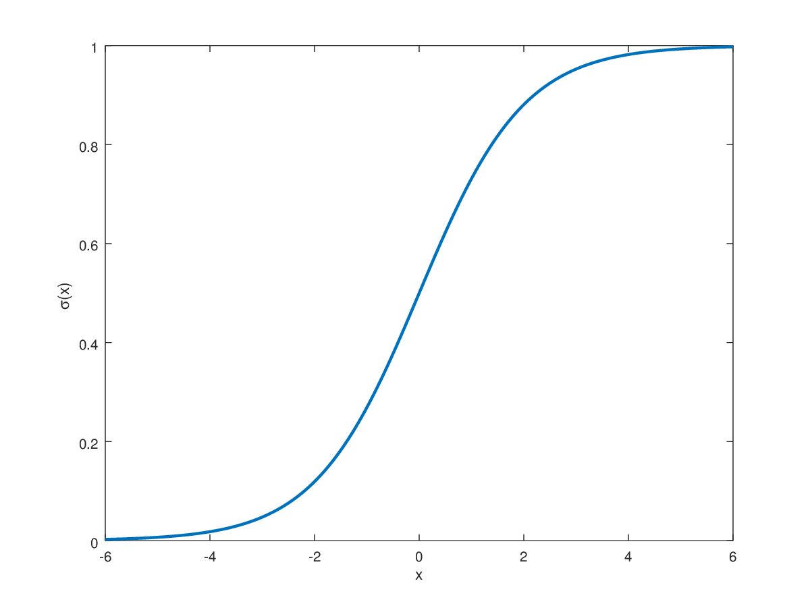

<br>

> Eye-Catching Graphs: <br>
> Creating a GIF in R <br>
> Using ggplot and gifski


# Introduction

Creating a GIF in **R** is extremely simple and only requires one additional package beyond <shortcode>ggplot2</shortcode>.

Below, we will look at a few GIF vinettes featuring three potential utilitarian purposes.  Then we will view some applied examples.  Finally, if time allows, we will look line-by-line at the code ourselves.

For pronouncation guide, see <a href="#conclusion">Conclusion</a>.


# Setup

The two packages we need our <shortcode>ggplot2</shortcode> and <shortcode>gifski</shortcode>.  

<shortcode>gifski</shortcode> is used to convert a series of plots into a gif.

```{r}
library(pacman)
pacman::p_load(tidyverse, ggplot2, gifski, formatR, RColorBrewer)
  
knitr::opts_chunk$set(echo=TRUE, message=FALSE, comment=NA, warning=FALSE, tidy=TRUE, results="hold", cache=FALSE, dpi=120)
```


## Aesthetic Example

<h6>Log-Sigmoid Curve</h6>
The link below shows a representation of a Log-Sigmoid function like that used in a logistic regression.

$$\sigma(x) = \frac{1}{1+e^{-x}}$$
<br><br>


<br><br>

View the GIF version here: <br>
<a href="https://siebelm.github.io/GIF/" target="_blank"><u>Log-Sigmoid GIF</u></a>

## Three Uses

Next, I show three utilitarian uses for GIFs

* <a href="#showing-multiple-x-y-charts">Showing multiple X, Y charts</a>
* <a href="#showing-a-z-parameter">Showing a Z parameter</a>
* <a href="#drawing-a-chart">Drawing a chart to guide the audience</a>

<i>The <a href="#Gapminder">Gapminder</a> example at the end will utilize all three(!)</i>


# Showing Multiple X, Y Charts

## Inverse Predictor
```{r, out.extra='id="chart75"', animation.hook="gifski"}
# Create Function for Chart
inverse_rel_bars <- function(iter, bar1, bar2) {
    for (i in 1:iter) {
        # Create Dataset with Random data
        scl <- abs(bar1 - bar2) / iter
        chg <- scl * i
        Variables <- c("Exp Var", "Target")
        Values <- c(bar1-chg, bar2+(chg/3))
        data <- data.frame(Variables, Values)
            
        # Grouped Bar Char
        plot <- ggplot(data, aes(fill=Variables, y=Values, x=Variables)) + 
            geom_bar(stat="identity") +
            ggtitle("Inverse Relationship") + 
            ylim(0, bar1) +
            scale_fill_manual(values=c("#7570B3", "maroon")) +
            theme_minimal()
        print(plot)
    }
}

# Save Chart to Hard Drive
invisible(save_gif(inverse_rel_bars(8, 90, 10), "inverse_rel_bars.gif", progress = FALSE))

# Display with R (Need animation.hook="gifski" in chunk options)
inverse_rel_bars(8, 90, 10)
```


## Inverse Predictor and Controls
```{r}
# Create Function for Chart
inverse_rel_ctrl_bars <- function(iter, bar1, bar2) {
    for (i in 0:(iter-1)) {
        # Create Dataset with Random data
        scl <- abs(bar1 - bar2) / iter
        chg <- scl * i
        Variables <- c("Control 1", "Control 2", "Control 3", "Exp Var", "Target")
        Values <- c(75, 65, 75, bar1-chg, bar2+(chg/3))
        data <- data.frame(Variables, Values)
            
        # Grouped Bar Char
        plot <- ggplot(data, aes(fill=Variables, y=Values, x=Variables)) + 
            geom_bar(stat="identity") +
            ggtitle("Inverse Relationship") + 
            ylim(0, bar1) +
            scale_fill_manual(values=c( rep("steelblue4",3), "#7570B3", "maroon")) +
            theme_minimal()
        print(plot)
    }
}

# Save Chart to Hard Drive
invisible(save_gif(inverse_rel_ctrl_bars(8, 90, 10), 
                   "inverse_rel_ctrl_bars.gif", progress = FALSE))
```


# Showing a Z Parameter

## Random Seed
```{r}
# Create Function for Chart
random_grouped_bars <- function(iter, bar1, bar2) {
    for (i in 1:iter) {
        # Create Dataset with Random data
        Variables <- c(rep("Var 1" , 2) , rep("Var 2" , 2) , 
                       rep("Var 3" , 2) , rep("Var 4" , 2) )
        Group <- rep(c("Group 1" , "Group 2") , 4)
        Values <- c(bar1, abs(rnorm(6, 0, 5)), bar2)
        data <- data.frame(Variables, Group, Values)
        seed <- abs(rnorm(1, 0, 100)) %>% round(1)
        set.seed(seed)
            
        # Grouped Bar Char
        plot <- ggplot(data, aes(fill=Group, y=Values, x=Variables)) + 
            geom_bar(position="dodge", stat="identity") +
            ggtitle("Random Data", paste("Seed", seed)) + 
            ylim(0, 15) +
            theme_minimal()
        print(plot)
    }
}

# Save Chart to Hard Drive
invisible(save_gif(random_grouped_bars(8, 5, 15), "random_grouped_bars.gif", progress = FALSE))
```


## Over Time
```{r}
# Create Function for Chart
opposing_grouped_bars_2 <- function(iter, startyear) {
    for (i in 1:iter) {
        # Create Dataset with Random Data
        year <- startyear+i-1
        chg <- year-(startyear-2)
        chg1_func <- function(value, chg) {
            x <- ifelse((value+chg) > 10, value+chg-10, value+chg)
            x <- x*x
            return(x)
        }
        chg2_func <- function(value, chg) {
            x <- ifelse((value-chg) < 2, value-chg+10, value-chg)
            x <- x*x
            return(x)
        }
        Variables <- c(rep("Var 1" , 2) , rep("Var 2" , 2) , 
                       rep("Var 3" , 2) )
        Group <- rep(c("Group 1" , "Group 2") , 3)
        Values <- c(chg1_func(3, chg),  chg2_func(10, chg), 
                    chg1_func(9, chg),  chg2_func(2, chg),
                    chg1_func(3, chg),  chg2_func(9, chg))
        data <- data.frame(Variables, Group, Values)
            
        # Grouped Bar Char
        plot <- ggplot(data, aes(fill=Group, y=Values, x=Variables)) + 
            geom_bar(position="dodge", stat="identity") +
            ggtitle("Opposing Groups Data", paste("Year", year)) + 
            ylim(0, 100) +
            theme_minimal()
        print(plot)
    }
}

# Save Chart to Hard Drive
invisible(save_gif(opposing_grouped_bars_2(6, 2001), delay = 0.9, 
                   "opposing_grouped_bars_2.gif", progress = FALSE))

```


## Waves
```{r}
# Create Function for Chart
opposing_grouped_bars <- function(iter, startyear) {
    for (i in 1:iter) {
        # Create Dataset with Random Data
        year <- startyear+i-1
        chg <- year-(startyear-2)
        chg1_func <- function(value, chg) {
            x <- ifelse((value+chg) > 8, value+chg-8, value+chg)
            x <- x*x
            return(x)
        }
        chg2_func <- function(value, chg) {
            x <- ifelse((value-chg) < 2, value-chg+8, value-chg)
            x <- x*x
            return(x)
        }
        Variables <- c(rep("Var 1" , 2) , rep("Var 2" , 2) , 
                       rep("Var 3" , 2) , rep("Var 4" , 2) , 
                       rep("Var 5" , 2) , rep("Var 6" , 2) , 
                       rep("Var 7" , 2) , rep("Var 8" , 2) )
        Group <- rep(c("Group 1" , "Group 2") , 8)
        Values <- c(chg1_func(3, chg),  chg2_func(10, chg), 
                    chg1_func(4, chg),  chg2_func(9, chg), 
                    chg1_func(5, chg),  chg2_func(8, chg), 
                    chg1_func(6, chg),  chg2_func(7, chg), 
                    chg1_func(7, chg),  chg2_func(6, chg), 
                    chg1_func(8, chg),  chg2_func(5, chg), 
                    chg1_func(9, chg),  chg2_func(4, chg),
                    chg1_func(10, chg), chg2_func(3, chg))
        data <- data.frame(Variables, Group, Values)
            
        # Grouped Bar Char
        plot <- ggplot(data, aes(fill=Group, y=Values, x=Variables)) + 
            geom_bar(position="dodge", stat="identity") +
            ggtitle("Opposing Groups Data", paste("Year", year)) + 
            ylim(0, 100) +
            theme_minimal()
        print(plot)
    }
}

# Save Chart to Hard Drive
invisible(save_gif(opposing_grouped_bars(12, 2001), delay = 0.3, 
                   "opposing_grouped_bars.gif", progress = FALSE))

```


# Drawing a Chart

## Dramatic Reveal
```{r}
# Create Dataset with Random Data
Year <- c(rep(2001 , 2) , rep(2002 , 2) , 
          rep(2003 , 2) , rep(2004 , 2) , 
          rep(2005 , 2) )
Group <- rep(c("Group 1" , "Group 2") , 5)
Values <- c(1,  2, 
            3,  4, 
            5,  8, 
            7,  16, 
            9,  32)
data <- data.frame(Year, Group, Values)
        
# Create Function for Chart
grouped_lines <- function(iter, startyear, data) {
    for (i in 1:iter) {
        year <- startyear+i-1
        
        # Censor Years
        plot_df <- data[seq(1, i*2), ]
            
        # Grouped Bar Char
        plot <- ggplot(na.omit(plot_df), aes(y=Values, x=Year, group=Group, color=Group)) + 
            geom_line(size=2) +
            ggtitle("Line Chart", paste("Year", year)) + 
            ylim(0, 35) + xlim(2001, 2005) +
            theme_minimal()
        print(plot)
    }    
}

# Save Chart to Hard Drive
invisible(save_gif(grouped_lines(5, 2001, data), delay = 0.6, 
                   "grouped_lines.gif", progress = FALSE))
```


## Drawing Complicated Lines
```{r}
# Create Dataset with Random Data
Year <- c(rep(2001 , 4) , rep(2002 , 4) , 
          rep(2003 , 4) , rep(2004 , 4) , 
          rep(2005 , 4) )
Group <- rep(c("Group 1" , "Group 2", "Group 3" , "Group 4") , 5)
Values <- c(1,  2,  8,  32,
            3,  4,  14, 16,
            5,  8,  20,  8,
            7,  16, 26,  4,
            9,  32, 32,  2)
data <- data.frame(Year, Group, Values)
        
# Create Function for Chart
draw_lines <- function(iter, startyear, data) {
    for (i in 2:(iter+1)) {
        year <- startyear+i
        
        # Censor Years
        plot_df1 <- data[seq(1, i*4-3, by=4), ]

        # Grouped Bar Char
        plot <- ggplot(na.omit(plot_df1), aes(y=Values, x=Year, group=Group, color=Group)) + 
            geom_line(size=2) +
            ggtitle("Line Chart", paste("Group 1, Year", year)) + 
            ylim(0, 35) + xlim(2001, 2005) +
            scale_color_manual(values=brewer.pal(n = 4, name = "Dark2")[1]) + 
            theme_minimal()
        print(plot)
    }
    for (i in 1:iter) {
        year <- startyear+i-1
        
        # Censor Years
        plot_df2 <- data[seq(2, i*4-2, by=4), ]
        plot_df <- rbind(plot_df1, plot_df2)
            
        # Grouped Bar Char
        plot <- ggplot(na.omit(plot_df), aes(y=Values, x=Year, group=Group, color=Group)) + 
            geom_line(size=2) +
            ggtitle("Line Chart", paste("Group 2, Year", year)) + 
            ylim(0, 35) + xlim(2001, 2005) +
            scale_color_manual(values=brewer.pal(n = 4, name = "Dark2")[1:2]) + 
            theme_minimal()
        print(plot)
    }    
    for (i in 1:iter) {
        year <- startyear+i-1
        
        # Censor Years
        plot_df3 <- data[seq(3, i*4-1, by=4), ]
        plot_df <- rbind(plot_df1, plot_df2, plot_df3)
            
        # Grouped Bar Char
        plot <- ggplot(na.omit(plot_df), aes(y=Values, x=Year, group=Group, color=Group)) + 
            geom_line(size=2) +
            ggtitle("Line Chart", paste("Group 3, Year", year)) + 
            ylim(0, 35) + xlim(2001, 2005) +
            scale_color_manual(values=brewer.pal(n = 4, name = "Dark2")[1:3]) + 
            theme_minimal()
        print(plot)
    } 
    for (i in 1:iter) {
        year <- startyear+i-1
        
        # Censor Years
        plot_df4 <- data[seq(4, i*4, by=4), ]
        plot_df <- rbind(plot_df1, plot_df2, plot_df3, plot_df4)
            
        # Grouped Bar Char
        plot <- ggplot(na.omit(plot_df), aes(y=Values, x=Year, group=Group, color=Group)) + 
            geom_line(size=2) +
            ggtitle("Line Chart", paste("Group 4, Year", year)) + 
            ylim(0, 35) + xlim(2001, 2005) +
            scale_color_manual(values=brewer.pal(n = 4, name = "Dark2")[1:4]) + 
            theme_minimal()
        print(plot)
    }     
}

# Save Chart to Hard Drive
invisible(save_gif(draw_lines(5, 2001, data), delay = 0.6, 
                   "draw_lines.gif", progress = FALSE))
```


# Applied Examples

## Example deliverable 


<br>

Using Python's Matplotlib, I created a HTML Report as a summary version of my Capstone Project
<br>

The link can be found here: <br>
<a href="https://siebelm.github.io/Bad_Banking_Behavior/" target="_blank">
  <u>Bad Banking Behavior</u>
</a>


## Gapminder

Hans Rosling is one of the best known practicioners of this form of data visualization.  In his most famous lecture, he plots 200 countries over 200 years using 120,000 numbers.  This entails plotting life expectancy against income for every country since 1810.  By having the plots scroll through each consective year, he shows the progress in which the world has made in becoming "less sick" and "more wealthy".

An example of his lecture can be found here: <br>
<a href="https://www.youtube.com/watch?v=jbkSRLYSojo" target="_blank">
  <u>Youtube Link</u>
</a>

You can find my recreation of his famous lecture using d3.js: <br>
<a href="https://siebelm.github.io/200_Countries/" target="_blank">
  <u>200 Countries</u>
</a>

```{r}
# Load Gapminder Data
pacman::p_load(gapminder)

# Create Function for Chart
makeplot <- function(){
  datalist <- split(gapminder, gapminder$year)
  lapply(datalist, function(data){
    p <- ggplot(data, aes(gdpPercap, lifeExp, size = pop, color = continent)) +
      scale_size("population", limits = range(gapminder$pop)) + geom_point() + ylim(20, 90) +
      scale_x_log10(limits = range(gapminder$gdpPercap)) + ggtitle(data$year) + theme_classic()
    print(p)
  })
}

# Save Chart to Hard Drive
invisible(save_gif(makeplot(), 'gapminder.gif', delay = 0.5, progress = FALSE))
```

Here is an ugly GIF version that you can create simply by copying and pasting code from <shortcode>?gifski</shortcode>


# Conclusion

Now that you know how to make a GIF, please make sure you are pronouncing it correctly! <br>
<a href="https://www.youtube.com/watch?v=N1AL2EMvVy0" target="_blank">
  <u>Youtube Link</u>
</a>

