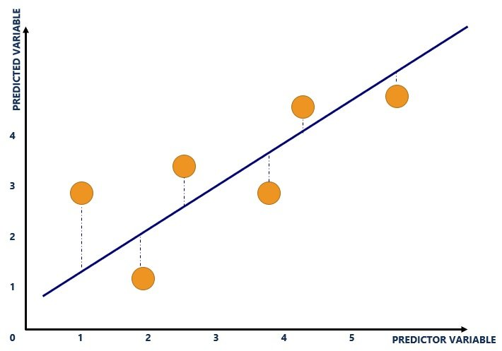
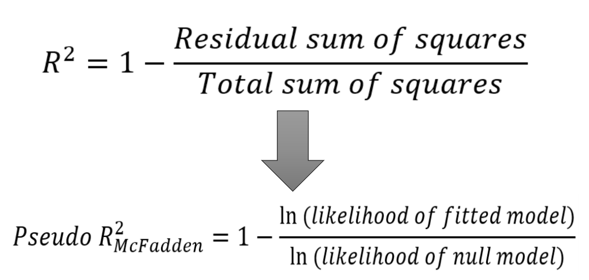
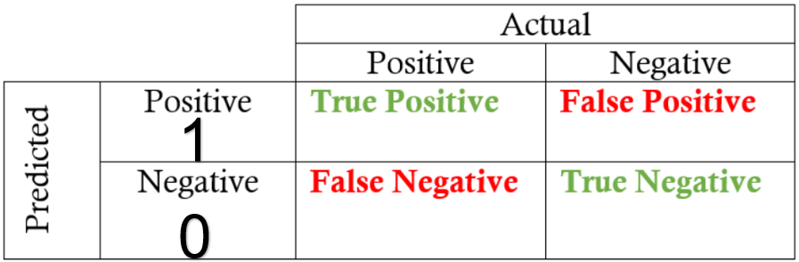
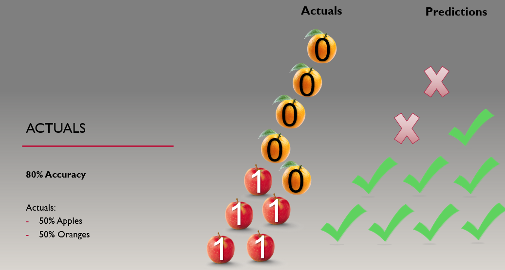
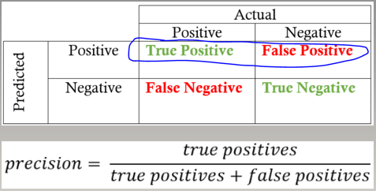
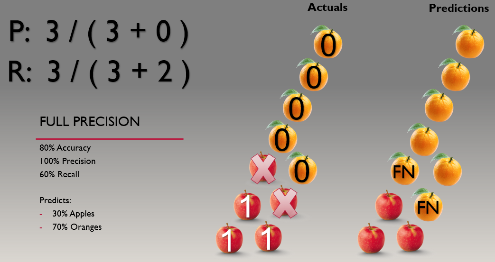
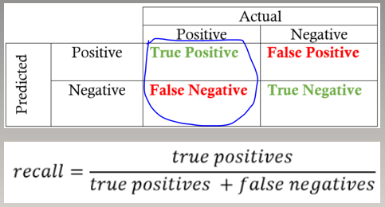
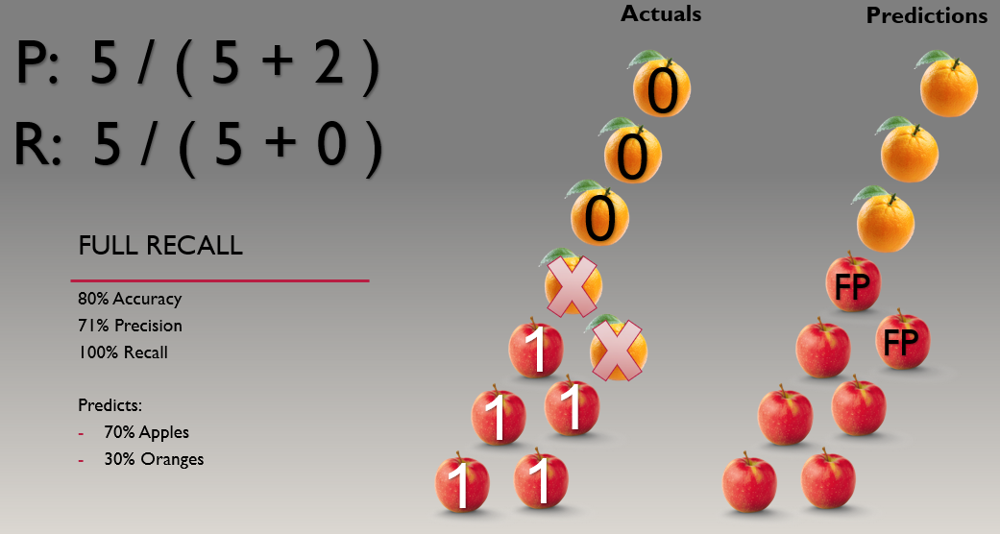
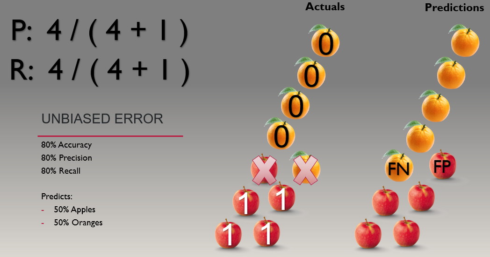

```{r include=FALSE}
pacman::p_load(tidyverse, ggplot2, 
               tm, tidytext, text2vec, stopwords, 
               caret, e1071, randomForest)
  
knitr::opts_chunk$set(echo=TRUE, message=FALSE, comment=NA, warning=FALSE, tidy=TRUE, results="hold", cache=FALSE, dpi=120)

source("Text_Functions.R")
load("Text_Data.RData")
```


# Model Fit
Perhaps the most popular form of model evaluation uses the goodness-of-fit statistic R<sup>2</sup>, which measures the distance (i.e., residual error) from the linear regression line.

      

Generalized linear models (GLM) such as <a>logistic</a>, <a>poisson</a>, and <a>gamma</a> GLMs can create their own, more indirect version of a R<sup>2</sup> called pseudo-R<sup>2</sup>.

        

There are two important limitations to R<sup>2</sup> and pseudo-R<sup>2</sup>:
    
<mpop>1) They only apply to parametric models</mpop>

<mpop>2) It evaluates the model on the same data that produced it</mpop>


# Alternative

## Splitting the Data

Another approach to model evaluation involves splitting data, modeling on one component, and evaluating on the other. A common split is 80% of data going to a training set and 20% going to a test set.

We will work with a text data set in which the outcome is positive sentiment or negative/neutral sentiment.

```{r}
print("Full data", quote = F)
print("Number of rows:", quote = F)
nrow(df)
cat("\n")

# Train/Test ID
set.seed(2021)
train_index <- sample(nrow(df), nrow(df)*0.80)

# Split train
train <- df[train_index, ]
test <-  df[-train_index, ]

print("Training data", quote = F)
print("Number of rows:", quote = F)
nrow(train)
cat("\n")

print("Testing data", quote = F)
print("Number of rows:", quote = F)
nrow(test)
cat("\n")

print("Distribution", quote = F)
( table(test$Target, dnn="Test Data")/nrow(test)*100 ) %>% round(1)
```

## Data Challenge

Here, we see a difficult dataset.  The classes are imbalanced.  The positive cases can be described as a rare event.  A normal modeling algorithm will provide many examples (i.e., rows) in which the model can learn what leads to a negative case, but few examples in which a model can learn what leads to a positive case.  

> As a result, most models of rare events will lead to a bias:<br>
> underpredicting positive cases and overpredicting negative cases.

## Data Cleaning

```{r}
#  Full Clean Text
CleanTextTrain <- train$Text %>%
                        basicclean() %>%
                        rm_stopwords() %>%
                        stemDocument()

#  Full Clean Text
CleanTextTest <- test$Text %>%
                      basicclean() %>%
                      rm_stopwords() %>%
                      stemDocument()

# DTM
bow_dtm <- bow_func(CleanTextTrain, CleanTextTest, 
                    doc_count_min = 10L)
train_dtm <- bow_dtm[[1]] %>% as.matrix()
test_dtm  <- bow_dtm[[2]] %>% as.matrix()

# Print
cat("Next, we will model train and predict on test\n
     Here is some pseudo code:
     1) model <- model_func(train)
     2) preds <- pred_func(model, test)
     3) eval  <- eval_func(preds, actuals)")
```


# Accuracy

## How It Works

Accuracy is a measure of exact matches.  In a binary, it measure True Postives, False Positives, False Negatives, and True Negatives.

      

<mpop>Problem:</mpop> It does not take the distribution of the 2 x 2 into account.

      

## Example

```{r}
# Labels
labels <- c("0 Neg/Neu", "1 Pos")

# Model
set.seed(2021)
model <- randomForest(x = train_dtm,
                      y = train$Target,
                      ntree = 500,
                      mtry = 0.25*ncol(train_dtm),
                      strata = train$Target,
                      sampsize = 500)

# Prediction
pred <- predict(model, test_dtm, type = "prob")[ , "1 Pos"]
test_labels <- ifelse(pred < 0.5, 0, 1)

# Error
test_labels <- factor(test_labels, labels = labels)
acc <- caret::confusionMatrix(test_labels, test$Target, positive = "1 Pos")

# Print
print("Accuracy", quote = F)
( acc$overall[[1]]*100 ) %>% round(1) %>% paste0("%")
cat("\n")

print("Confusion Matrix", quote = F)
cmat <- table(test_labels, test$Target, dnn=c("Predicted", "Actuals"))
cmat
cat("\n")

print("Distribution", quote = F)
( table(test$Target, dnn="Actual")/nrow(test)*100 ) %>% round(1)
cat("\n")
( table(test_labels, dnn="Prediction")/nrow(test)*100 ) %>% round(1)
```


# Precision

## How It Works

Precision is a measure of true positives and false positives.  With full precision, all of your predictions of positives are correct, but they are not all encompassing.

      

I think of this as a conservative approach: everything you predict is correct--it's just not everything that should have been predicted.

In other words, all of the apples are predicted, but TWO apples are not predicted.

 

## Example

```{r}
print("Precision", quote = F)
( acc$byClass["Precision"][[1]]*100 ) %>% round(1) %>% paste0("%")

cat("\n")
cat("Precision =  TP / ( TP + FP )")
cat("\n")
cat("Precision =  ", cmat[2,2], " / ( ", cmat[2,2], " + ", cmat[2,1], " )")
```


# Recall

## How It Works

Recall is a measure of true positives and false negatives  With full recall, all positives are predicted, but some predictions are not true positives.

      

I think of this as a liberal approach: it casts a "large net" that captures everything but it captures too much.

In other words, all of the apples are predicted, but TWO apples are not predicted.

 

## Example

```{r}
print("Recall", quote = F)
( acc$byClass["Recall"][[1]]*100 ) %>% round(1) %>% paste0("%")

cat("\n")
cat("Recall =  TP / ( TP + FN )")
cat("\n")
cat("Recall =  ", cmat[2,2], " / ( ", cmat[2,2], " + ", cmat[1,2], " )")
```


# Unbiased Error

A measure of an unbiased error is one that balances precision and recall.  This means that it the number of False Positives is roughly equivalent to the number of False Negatives.  With an unbiased error, the aggregate statistic is roughly correct, but once an analyst attempts to break it into smaller cuts, the more prone it is to error.

 

In cases of rare events, recall is likely much lower than precision (assuming the positive case is the rare event).  To decrease error bias, then, one will need to increase recall or "cast a larger net".

# Improvement

## How to improve the model

The goal of this run is to artifically balance the classes to "cast a larger net" (increase recall) and create a better precision-recall tradeoff.

Generally, my process for dealing with rare events is to down sample the data, balance the classes, and run a bagging algorithm.  Then, if the model needs to be improved, two additional steps I consider is involves: 

  1) Running restructured models and ensembling them using a voting or stacked ensembling method.  This increases the generalizability of the final model output, which is important since the restructuring usually involves a lot of manual interventions on the analyst's part.
  
  2) Adapting the hard limit threshold.  Normally, a binary threshold is 0.5.  Reducing this number "casts a larger net" in cases of rare events.  Alternatively, rebalancing efforts may lead to overprediction (i.e., low precision) on the test data.  In this case, one can increase this number to compensate.  This can be done by splitting the data into three sets--a train set (70%), a validation set (15%), and a test set (15%).  One can then model the train set, determine an optimal threshold on the validation set, and then evaluate the final model on the test set.
  
It is a lot of work, but if it leads to a better precision-recall tradeoff (i.e., a less biased error), it will be worth it.

## Example

In this example, I  down sample the data, balance the classes, and run a random forest bagging algorithm.

```{r}
# Smallest Classes
nmin <- min(table(train$Target))

# Model
set.seed(2021)
model_bal <- randomForest(x = train_dtm,
                          y = train$Target,
                          ntree = 500,
                          mtry = 0.25*ncol(train_dtm),
                          strata = train$Target,
                          sampsize = rep(floor(nmin) / 2))   

# Prediction
pred <- predict(model_bal, test_dtm, type = "prob")[ , "1 Pos"]
test_labels <- ifelse(pred < 0.5, 0, 1)

# Error
test_labels <- factor(test_labels, labels = labels)
acc <- caret::confusionMatrix(test_labels, test$Target, positive = "1 Pos")

# Print
print("Accuracy", quote = F)
( acc$overall[[1]]*100 ) %>% round(1) %>% paste0("%")
cat("\n")

print("Precision", quote = F)
( acc$byClass["Precision"][[1]]*100 ) %>% round(1) %>% paste0("%")

print("Recall", quote = F)
( acc$byClass["Recall"][[1]]*100 ) %>% round(1) %>% paste0("%")

print("Confusion Matrix", quote = F)
cmat <- table(test_labels, test$Target, dnn=c("Predicted", "Actuals"))
cmat
cat("\n")

print("Distribution", quote = F)
( table(test$Target, dnn="Actual")/nrow(test)*100 ) %>% round(1)
cat("\n")
( table(test_labels, dnn="Prediction")/nrow(test)*100 ) %>% round(1)
```

To improve beyond this, I would create multiple datasets using different document term matrix (DTM) criteria such as sparsity thresholds and types of term weighting as well as create word embedding datasets.  I would then run different models, adjusting modeling parameters, and vote or stack ensemble.  If this is still not successful, I would adapt the hard limit threshold.

```{r, include=F}
save(df, train_dtm, test_dtm, model, model_bal, file = "model_eval.RData")
```
